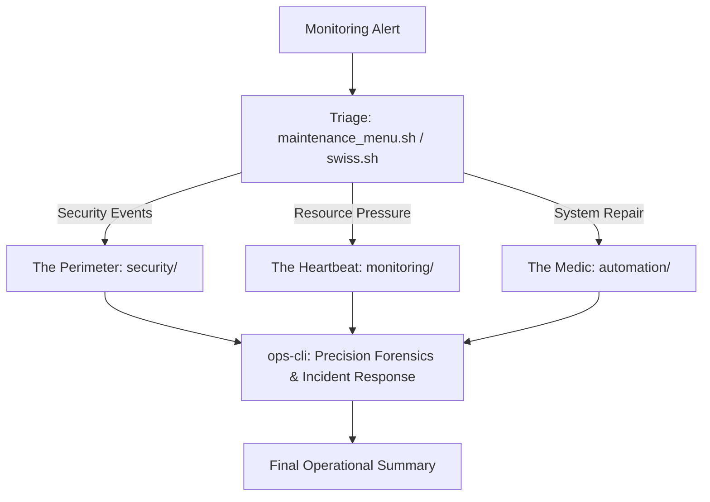

# 🛡️ Unified Ops Core: Built for the Edge


A library of production-hardened tools for Linux server operations. It combines battle-tested Bash scripts for quick triage with a Go-powered engine (`ops-cli`) for precision forensics and incident response.

> [!IMPORTANT]
> These are tools for humans, not autonomous bots. They require precise operator input — IPs, paths, domains — to function. No action is taken without your intent.

---

## Repository Map

```
Scripts/
├── automation/          # Server maintenance and optimization scripts
│   ├── swiss.sh         # Interactive multi-tool (port, IP, logs, processes)
│   ├── maintenance_menu.sh  # Primary command center / triage hub
│   ├── optimize.sh      # Apache & MySQL tuning based on available RAM
│   ├── maxworker.sh     # Apache MaxRequestWorkers calculator
│   ├── log_fixer.sh     # Disk-full rescue: log cleanup & permission repair
│   ├── permfix.sh       # Bulk permission correction
│   ├── mailish.sh       # Exim mail queue analysis
│   ├── zbxsetup.sh      # Zabbix agent deployment
│   ├── porta.sh         # Port management utilities
│   ├── sslrewrite.sh    # SSL/HTTPS rewrite rule helper
│   ├── dbim.sh          # Database import helper
│   └── wordpressfiles.sh # WordPress file integrity utility
│
├── monitoring/          # Observability and diagnostics
│   ├── plesk_health.sh  # Full Plesk stack diagnostic report
│   ├── cpustats.sh      # CPU, I/O wait, and load analysis
│   ├── sysmon.sh        # Live system monitor (CPU/RAM/Load)
│   ├── disk_analyzer.sh # Disk usage per directory
│   ├── adlog.sh         # Apache domain log analysis
│   ├── httplogs.sh      # HTTP access log parser
│   ├── stress_test.sh   # Basic load generation for service stress testing
│   └── ec.pl            # Exim log analyzer (Perl, legacy)
│
├── security/            # Server hardening and incident response
│   ├── hardening.sh     # Full cPanel/WHM server baseline hardening
│   ├── spamcheck.sh     # Exim spam investigation and queue control
│   ├── abuse_report.sh  # Domain abuse evidence collector
│   ├── icmaldet.sh      # ImunifyAV maldet scan wrapper
│   ├── whitelist.sh     # CSF firewall IP whitelist management
│   └── portsetup.sh     # Quick firewall port management
│
└── Go/ops-cli/          # Go-powered precision engine
```

---

## 🏗️ Onion Layer Defense

When an alert fires, the workflow is structured in three layers:



---

## 🛡️ Layer 1: The Perimeter (`security/`)

Stops threats at the boundary. Targeted at L3–L4 defense and policy enforcement.

| Script | Purpose |
|---|---|
| `hardening.sh` | One-shot cPanel/WHM baseline: installs `chkrootkit` + `ClamAV`, configures `CSF` firewall, disables 15+ unneeded services, sets `apache` headers (`ServerTokens ProductOnly`), disables dangerous PHP functions (`exec`, `shell_exec`, `system`, `passthru`, etc.), secures `pure-ftpd`, changes SSH port to `1243`, creates a `wheel` user, hardens `/tmp`, and configures WHM backups. |
| `spamcheck.sh` | Interactive Exim queue investigation: count queue, flush by sender, check delivery status. |
| `abuse_report.sh` | Collects evidence for a domain's abuse case. |
| `icmaldet.sh` | Trigger `imunify360` / `maldet` scan on a target path. |
| `whitelist.sh` | Add an IP to CSF's allow list. |
| `portsetup.sh` | One-command TCP port open via CSF/iptables. |

---

## 🛰️ Layer 2: The Heartbeat (`monitoring/`)

Real-time visibility into what the server is actually doing.

| Script | Purpose |
|---|---|
| `plesk_health.sh` | Comprehensive Plesk stack report: services, disk, mail queue, MySQL status. |
| `cpustats.sh` | CPU breakdown per core with I/O wait highlighting — catches disk-bound load. |
| `sysmon.sh` | Live rolling display of CPU, RAM, and load averages. |
| `adlog.sh` | Apache domain log tail and pattern matching. |
| `disk_analyzer.sh` | Disk usage ranked by directory size. |
| `httplogs.sh` | HTTP access log parser for traffic analysis. |
| `stress_test.sh` | Simple `ab`/`curl` load generation for service validation. |
| `ec.pl` | Legacy Perl Exim log counter (replaced by `ops-cli email`). |

---

## 🏥 Layer 3: The Medic (`automation/`)

High-precision tools that restore service and tune performance.

| Script | Purpose |
|---|---|
| `swiss.sh` | Interactive 13-option menu: port check/open, IP delist, process inspection, log viewing (Apache, Exim, MySQL, FTP, Dovecot), file search, permission changes. Supports CentOS (`iptables`) and Ubuntu (`ufw`). |
| `maintenance_menu.sh` | Primary incident triage hub — the first tool opened during an incident. |
| `optimize.sh` | Calculates `MaxRequestWorkers` and `innodb_buffer_pool_size` based on system RAM. |
| `log_fixer.sh` | Emergency disk-full rescue: identifies and truncates oversized logs, fixes permissions. |
| `maxworker.sh` | Standalone Apache worker calculator. |
| `permfix.sh` | Corrects cPanel account file/directory permissions in bulk. |
| `zbxsetup.sh` | Automated Zabbix agent install and server registration. |

---

## 🚀 Layer 4: The Engine (`Go/ops-cli/`)

A statically-compiled Go binary that provides what shell scripts cannot: parallel execution, mathematical analysis, and safe automated remediation.

| Capability | What the Engine Does |
|---|---|
| `forensics scan` | Parallel 8-worker malware scanner with 12 built-in signatures + Shannon entropy analysis (threshold > 5.5) on the first 4 KB of each file |
| `forensics persistence` | Audits shell init files and crontabs for command hijacking, remote script execution, and hidden persistence paths |
| `forensics timeline` | Reports all files modified within a time window (`--since 24h`) |
| `forensics restore` | Restores quarantined files using JSON sidecar metadata |
| `monitor connections` | Parses `/proc/net/tcp` to show TCP state breakdown |
| `monitor thundering` | Detects thundering herd by SYN_RECV count (threshold: `--threshold 100`) |
| `monitor serve` | Starts Prometheus-compatible metrics exporter on `:9090` |
| `response` | Runs 6 health checks (Load > 5.0, httpd:80, mysql:3306, MinerCheck, OOMCheck, KillerProcessCheck) and executes remediations — safe `--dry-run=true` by default |
| `security harden` | Audits SSH and FTP configs without modifying them |
| `security abuse` | Packages domain logs into a timestamped `.zip` file |
| `email` | Parses `/var/log/exim_mainlog` for total volume + top 10 senders |
| `optimize` | Calculates Apache MaxRequestWorkers and MySQL buffer pool size from live RAM |
| `logs` | Searches Apache/Exim/MySQL/System logs with `--query` and `--limit` |
| `disk` | Lists top-N largest files and directories with `--top` and `--min-size` |
| `network` | Checks and unblocks IPs across CSF, Firewalld, and IPTables |
| `system` | Reads CPU, RAM, and load average from `/proc` with `--json` support |

[→ Full ops-cli Command Reference with all flags and examples](./Go/ops-cli/README.md)

---

## Design Philosophy

- **Zero-Dependency Shell Core**: Every shell script uses standard GNU utilities (`awk`, `sed`, `grep`, `lsof`, `nc`). No external package installs required.
- **Modular & Self-Contained**: Each script can be dropped onto any Linux server and run immediately.
- **Go Engine for Precision**: The `ops-cli` binary uses zero external runtime dependencies (only `cobra` for CLI structure) and reads OS state directly from `/proc`.
- **Human-Led Remediation**: No autonomous action without operator intent. `--dry-run` is the default on destructive operations.
- **CI/CD Compatible**: `ops-cli` commands exit with code `1` on detections (forensics, response), making them pipeline-native.

---

**Standardized for Resilience. Optimized for the Edge.**
*Maintained by Nihar.* 🛡️✨
