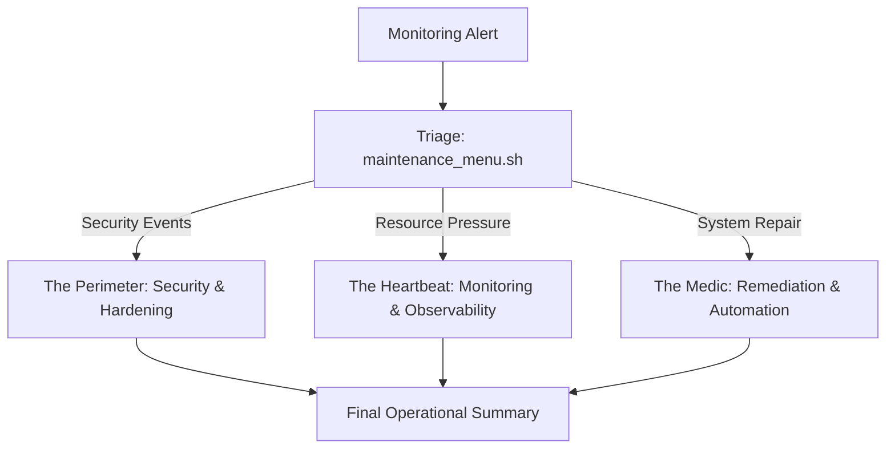

# 🛡️ Unified Ops Core: Built for the Edge

 


This isn't just a collection of shell scripts; it's the distilled reality of managing production servers at scale. I built this library to stop fighting fires and start engineering solutions that work for my team while I sleep. 

> [!IMPORTANT]
> These are tools for humans, not autonomous bots. To work effectively, they require precise input from the operator (IPs, paths, configurations).

---

## 🏗️ The Blueprint for Precision
I designed this stack using an **Onion Layer Defense**. We don't just fix symptoms; we use these remediation utilities to shed load and neutralize threats at the perimeter.



### 🛡️ [1] The Perimeter (Security & Hardening)
This is where we kill the noise. Focused on L3-L4 defense and system-wide policy management.
- `hardening.sh`: My standard baseline for production environments. 
- `whitelist.sh` & `portsetup.sh`: Quick-action firewall management. No more digging through `iptables` syntax.

### 🛰️ [2] The Heartbeat (Monitoring & Observability)
Real-time visibility into the "Actual Reality" of the server stack.
- `cpustats.sh` & `sysmon.sh`: Because I need to see I/O wait and memory pressure *before* the service crashes.
- `plesk_health.sh`: Total diagnostics for the stack.

### 🏥 [3] The Medic (Remediation & Assisted Automation)
High-precision tools that act on operator data to restore service.
- `maintenance_menu.sh`: My primary command center. One menu, all the logs and diagnostics.
- `log_fixer.sh`: The "Disk Full" rescue tool. It cleans the mess and sets permissions based on your requirements.
- `optimize.sh`: High-performance tuning for Apache and MySQL based on actual available RAM.

---

## 🚀 Why this works
Engineering excellence in shell scripting isn't about complexity; it's about **reliability and portability.** 

- **Zero-Dependency Core**: Every tool is built on standard GNU utilities (`awk`, `sed`, `grep`, `lsof`). They run on any Linux box without installing external packages or libraries.
- **Modular Design**: Scripts are decoupled and self-contained. You can drop a single file onto a server and run it immediately without worrying about global state or environmental clutter.
- **High-Speed Triage**: By unifying log parsing and network diagnostics into single-command interfaces, we remove the cognitive load of manual troubleshooting during high-pressure incidents.
- **Standardized Headers**: Every tool features standard professional headers and follows the "No-Password, No-BS" execution model for automation.

[View `ops-cli` Advanced Documentation (Go Engine)](./Go/ops-cli/README.md)

---

## 🛠️ Usage
For a full breakdown of every tool and detailed execution examples, see my **[Operations Manual (Usage.md)](./Usage.md)**.

```bash
# Verify The Heartbeat
./automation/maintenance_menu.sh
```

---
**Standardized for Resilience. Optimized for the Edge.**  
*Maintained with passion by Nihar.* 🛡️✨
