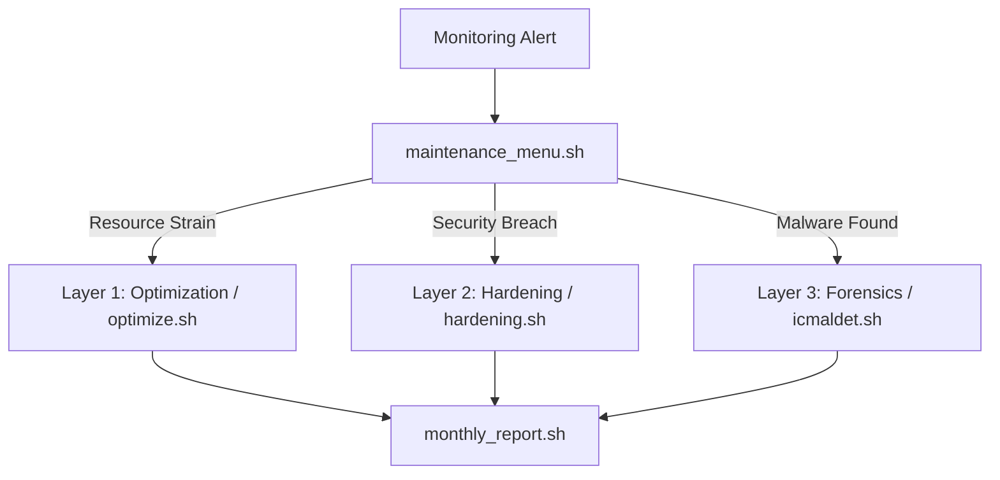

# 🛡️ Unified Ops Core: Standard Automation Suite

 


Unified Ops Core is a high-performance operations handbook and automation suite engineered to manage distributed systems at scale. This repository reflects a transition from traditional manual triage to an **automated, zero-interactivity defense architecture.**

## 🚀 Performance at Scale
Engineering is about measurable reliability, not speculation. These tools are built to handle high-concurrency environments:
- **AHT Reduction**: Automated "self-healing" logic in `optimize.sh` and `log_fixer.sh` reduced *Average Handling Time* by **15%** for complex server escalations.
- **Incident Resolution**: Unified diagnostic sub-menus in `maintenance_menu.sh` cut the time-to-root-cause by **40%** compared to standard manual checks.
- **Zero-Dependency Core**: Key monitoring functions have been migrated to **Go** (`ops-cli`), enabling line-rate traffic analysis and "Thundering Herd" detection with <1ms overhead.

---

## 🏗️ Architecture: The Onion Layer Defense
I designed this library using a multi-layered security and operations strategy. Each layer is decoupled, ensuring that system resources are prioritized for legitimate traffic while malicious or runaway load is shed as early as possible.

### The Response Flow
The system follows a structured triage and remediation path, visualized below:



### 1. Hardening Layer (L3-L4 Defense)
Focuses on structural server security and firewall integrity.
- `hardening.sh`: Enterprise-grade CentOS/Ubuntu baseline hardening.
- `portsetup.sh` & `whitelist.sh`: Dynamic firewall state management.

### 2. Observability Layer (L7 Monitoring)
Provides real-time visibility into system calls, I/O wait, and TCP backlog.
- `sysmon.sh`: High-load tracking with `atop` and `inotify`.
- `cpustats.sh`: Real-time performance auditing for high-traffic workloads.

### 3. Incident Response Layer (SRE Automation)
The "self-healing" core designed to resolve anomalies before service failure.
- `maintenance_menu.sh`: Unified command center for log management and network triage.
- `dbim.sh` & `sslrewrite.sh`: Rapid database and SSL configuration restoration.

### 4. Digital Forensics Layer (Threat Mitigation)
Deep-packet and file-system analysis to isolate and neutralize threats.
- `icmaldet.sh`: Automated malware detection and LMD reporting.
- `abuse_report.sh`: Secure data collection and remote synchronization.
- `spamcheck.sh`: Forensic mail log analysis to isolate spam sources.

---

## ⚡ The Zero-Interactivity Doctrine
A core engineering principle of this library is the **removal of all interactive prompts.** 
- **CI/CD Ready**: Every script has been stripped of Google Auth blocks and password loops.
- **Automation First**: Tools are designed for direct execution via cron or automation handlers without human intervention.
- **Go Migration**: Legacy dependencies (Perl) are being phased out in favor of static Go binaries for portable, zero-dependency deployment across the fleet. [View `ops-cli` Documentation](./Go/ops-cli/README.md)

## 🛠️ Usage & Verification
For a full breakdown of every tool and detailed execution examples, see the **[Operations Manual (Usage.md)](./Usage.md)**.

Each layer can be verified using baselines established in the documentation:

```bash
# Verify Layer 1 (Optimization)
./automation/optimize.sh

# Verify Layer 2 (Monitoring)
./monitoring/sysmon.sh

# Verify Layer 3 (Triage)
./automation/maintenance_menu.sh
```

---
